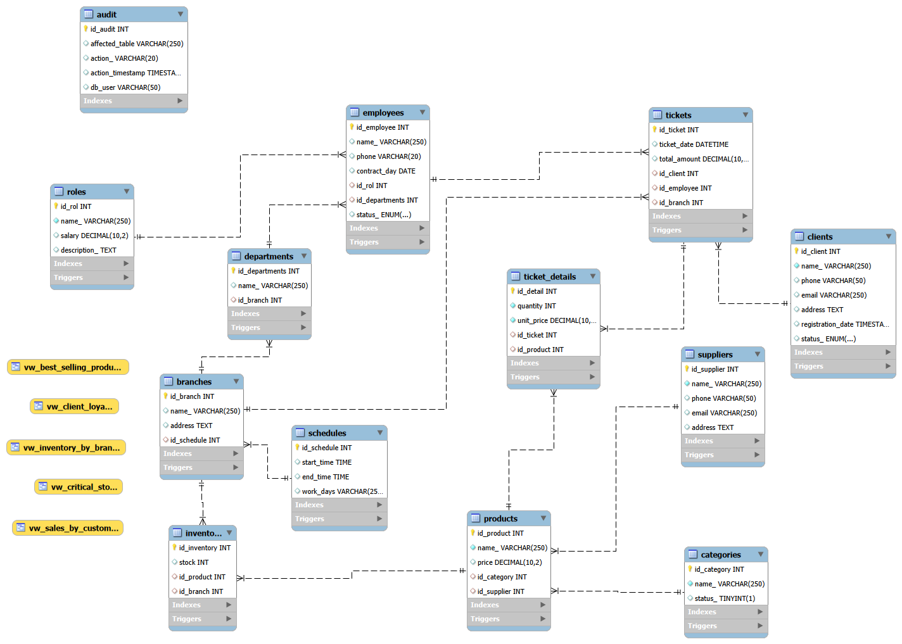

# Database System - Video Game Store
#### ¡Welcome! 

This project arises from a fictional problem proposed in class; it consists of the design and implementation of a database for a video game store
with multiple branches that has various needs, such as organizing the chaos involved in managing the stores and ensuring that products reach players,
that inventory never runs out, and that sales flow without errors.

##### The system is based on a relational model, and its objective is to manage the main entities identified for the business.
| Products, in this case video games and accessories, etc.  |
| ------------ |
|Customers, the main buyers in the stores. |
|Employees who work in each of the branches. |
|Branches that exist in this chain of stores.  |
|Inventory for each branch. |
|Sales for each branch|
|Suppliers that the store chain has in general  |
|Warehouse for all stores. |
|Receipts for each purchase. |
|Employee roles. |
|Departments in each branch.|

---

#### The functionalities we want this system to have in general:

- Ability to maintain inventory control per branch.

- Keep detailed sales records.

- Manage relationships between products and suppliers.

- Audit the operations performed.

- Use of triggers for automation.

- Stored procedures for insert operations.

- Views as reports for analysis.

#### The main technical features include the use of primary and foreign keys, data normalization, triggers for automatic updates, views for reporting, and stored procedures.

---
#### The reports generated in this database are created directly using views; they include reports for data analysis.
1. Inventory by branch: the inventory available in each store.

2. Sales report by customer: Who are our most frequent customers?

3. Best-selling products report: Which products are the most sold across all branches?

4. Loyalty report: Who are our most frequent customers?

5. Critical stock report: Which branch needs urgent restocking?

---
##### Entity-relationship diagram

---

###### This project is for educational purposes only and not for profit.

